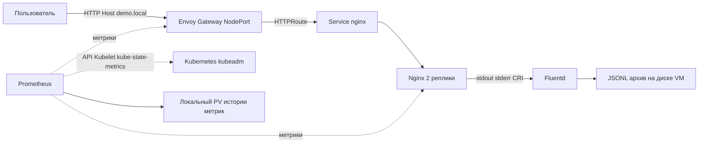

# DevOps стенд для MTC ENGINEER HACK

Автоматизация создает одноузловой Kubernetes-кластер на отдельной Ubuntu Server
24.04: containerd, kubeadm, kubelet, kube-proxy, CoreDNS и Calico. После установки
проверяются API, версии, готовность узла, DNS, связь Pod → Service → Pod и прямое
обращение между Pod. Временные тестовые ресурсы удаляются автоматически.

После создания основы `make deploy` устанавливает демонстрационный Nginx:
две реплики, внутренний Service, HTTP-ответ `Hello World!`, проверки здоровья
и access/error-логи, затем Envoy Gateway, HTTP-маршрут через NodePort, Prometheus и Fluentd.
Подготовлены все пять технических этапов кейса MTC ENGINEER HACK;
работоспособность на Ubuntu VM еще предстоит подтвердить.

**Статус:** выполнены локальные проверки YAML, синтаксиса Ansible, шаблонов,
контрольных сумм и 90 автоматических тестов. Promtool 3.13.3 проверил конфигурацию,
семь правил и три сценария предупреждений. Развертывание, повторный запуск и
перезагрузка на Ubuntu VM пока не проверены: VM еще не предоставлена. Поддержка
amd64 и arm64 предусмотрена конфигурацией, но не подтверждена испытаниями.

## Архитектура



Один узел Ubuntu 24.04, сеть Calico VXLAN и containerd. Все Kubernetes-ресурсы
создаются Ansible из файлов репозитория. Метрики и логи хранятся на VM;
платные сервисы и инфраструктура участника для воспроизведения не нужны.

## Материалы для экспертов

- [Паспорт решения](docs/Паспорт.pdf) — архитектура, реализация и статус проверки.
- [Формат сдачи и соответствие критериям](docs/submission.md).
- [Приемочные испытания](docs/acceptance.md) и [локальные результаты](docs/local-validation.json).

Фактическая среда выполненных локальных проверок — macOS. Ubuntu Server 24.04
является целевой ОС; испытание на ней пока не проводилось.

## Состав

| Компонент | Закрепленная версия |
|---|---|
| Целевая ОС | Ubuntu Server 24.04 LTS |
| Kubernetes | 1.35.9 |
| Пакеты kubeadm, kubelet, kubectl | 1.35.9-1.1 |
| containerd.io | 2.2.6-1~ubuntu.24.04~noble |
| Calico | 3.32.2, VXLAN, IPv4 |
| Ansible Core | 2.19.3 |
| Приложение | nginx-unprivileged:1.30.5-alpine, закреплен digest |
| Тестовый контейнер | busybox:1.37.0, закреплен digest |
| Реализация Gateway API | Envoy Gateway 1.9.2, закреплен digest |
| Gateway API CRD | 1.6.1, experimental channel из официального bundle |
| Envoy Proxy | distroless-v1.39.1, штатный digest из исходников Gateway 1.9.2 |
| Prometheus | 3.13.3 LTS, закреплен digest |
| kube-state-metrics | 2.19.1, закреплен digest |
| Nginx exporter | 1.5.3, закреплен digest |
| Fluentd | 1.19.3, образ v1.19.3-debian-2.2, закреплен digest |

`versions.yml` содержит версии инфраструктуры; `requirements.lock` — версии
Python-зависимостей управляющей машины. Версия образа pause определяется самим
закрепленным kubeadm. Системные зависимости Ubuntu получают доступные обновления
из репозитория ОС; установка не является побитовым воспроизведением образа диска.
Образы Nginx и BusyBox закреплены по digest многоархитектурного индекса; данные
проверки реестра находятся в `docs/image-lock.json`. Образы Calico и компонентов
Kubernetes пока закреплены тегами релизов. Для них фиксация digest остается
задачей перед окончательной сдачей. Для Gateway контроллер и shutdown manager
используют один закрепленный digest. Envoy Proxy использует штатный digest
релиза; дополнительная проверка этого digest в реестре не завершилась из-за
сетевого таймаута. Данные об образах Gateway находятся в `docs/gateway-image-lock.json`.

Исходный манифест Calico и ключи APT находятся в `vendor/`. Их контрольные суммы
проверяются до `make bootstrap`. Во время развертывания манифест переводится в
режим VXLAN, задается Pod CIDR, отключаются проверки BGP. Файлы upstream сохраняются
без изменений. Установка требует доступа к публичным репозиториям и реестрам.

## Требования к машине

- Отдельная чистая VM с Ubuntu Server 24.04, systemd, amd64 или arm64.
- Рекомендуется 4 vCPU, 8 ГБ RAM, диск 40 ГБ; проверка допускает от 2 vCPU,
  около 4 ГБ выделенной RAM и 15 GiB свободного места в `/var/lib`.
- Стабильный IPv4 адрес VM и стандартный маршрут. При нескольких интерфейсах
  задайте `cluster_address` в `config.yml` явно.
- Пользователь с `sudo`, Python 3 и, для удаленного запуска, SSH.
- Исходящий HTTPS и DNS к репозиториям Ubuntu, `pkgs.k8s.io`,
  `download.docker.com`, `registry.k8s.io`, `quay.io`, Docker Hub и их CDN.
- Входящий SSH — только с управляющей машины. Kubernetes API TCP 6443 нужен
  снаружи только для удаленного kubectl; не открывайте его всему интернету.

Профиль рассчитан на изолированную лабораторную сеть без активных UFW,
firewalld и NetworkManager. `doctor` остановится, если они активны; автоматизация
не отключает защиту машины. Используйте Ubuntu Server с systemd-networkd и
ограничениями доступа на уровне сети VM/провайдера. VXLAN использует UDP 4789;
межузловое взаимодействие потребуется при будущем расширении кластера.

Pod CIDR по умолчанию `10.244.0.0/16`, Service CIDR `10.96.0.0/12`.
Они не должны пересекаться с сетью VM, VPN и сетями клиентов. `doctor` обнаруживает
пересечения с адресами и маршрутами VM, но не видит удаленные сети, отсутствующие
в ее таблице маршрутизации. Пользователь должен проверить их отдельно.

## Запуск внутри будущей Ubuntu VM

Скопируйте каталог проекта на VM. Все команды этого раздела выполняются в нем,
обычным пользователем. Не запускайте `make setup` через sudo.

```bash
sudo apt-get update
sudo apt-get install -y python3 python3-venv make
make setup
make doctor INVENTORY=inventory.local.ini EXTRA_ARGS='--ask-become-pass'
make bootstrap INVENTORY=inventory.local.ini EXTRA_ARGS='--ask-become-pass'
make deploy INVENTORY=inventory.local.ini EXTRA_ARGS='--ask-become-pass'
make verify-all INVENTORY=inventory.local.ini EXTRA_ARGS='--ask-become-pass'
```

Если sudo работает без пароля, уберите `EXTRA_ARGS='--ask-become-pass'`.
`bootstrap` сам проверяет основу до и после установки, `deploy` — приложение, Gateway, мониторинг и доставку логов.
`verify` проверяет основу, `verify-app` — приложение, `verify-gateway` — Gateway,
`verify-monitoring` — мониторинг, `verify-logging` — доставку логов, `verify-all` — все пять этапов.
Первое выполнение требует скачивания пакетов
и образов, поэтому его длительность зависит от сети.

## Запуск с управляющей машины по SSH

Нужны Python 3.11 или новее, make и SSH. Целевая машина по-прежнему Ubuntu 24.04.
На Mac выполняются только локальная подготовка инструментов и подключение по SSH;
настройка ОС и Kubernetes выполняется на адресе из inventory.

```bash
make setup
cp inventory.example.ini inventory.ini
```

В `inventory.ini` замените пример `192.0.2.10` и пользователя `ubuntu` на реальные
значения. Проверьте SSH fingerprint VM по доверенному каналу и выполните первое
подключение самостоятельно. Проверка SSH host key включена.

```bash
make doctor EXTRA_ARGS='--ask-become-pass'
make bootstrap EXTRA_ARGS='--ask-become-pass'
make deploy EXTRA_ARGS='--ask-become-pass'
make verify-all EXTRA_ARGS='--ask-become-pass'
```

Не сохраняйте SSH-ключи и sudo-пароли в репозитории.

## Настройка адреса и сетей

При необходимости скопируйте `config.example.yml` в `config.yml`, измените
значения и передавайте один и тот же файл во все команды:

```bash
make doctor INVENTORY=inventory.local.ini EXTRA_ARGS='--ask-become-pass -e @config.yml'
make bootstrap INVENTORY=inventory.local.ini EXTRA_ARGS='--ask-become-pass -e @config.yml'
```

Редактирование этих параметров допустимо до первого bootstrap. Автоматизация
сохраняет их в `/etc/devops-foundation/lock.json` и останавливается при расхождении
на повторном запуске. Изменение версий тоже считается миграцией, а не bootstrap.

## Что меняет bootstrap

1. Проверяет ОС, ресурсы, занятые порты, адреса, маршруты и существующие установки.
2. Фиксирует параметры стенда, устанавливает системные зависимости.
3. Отключает активный swap и комментирует swap-записи `/etc/fstab` с резервной копией.
   Другие генераторы swap, например zram, не поддерживаются этим профилем.
4. Загружает overlay, br_netfilter и vxlan; включает IP forwarding.
5. Добавляет подписанные APT-репозитории и устанавливает точные версии пакетов.
   kubeadm, kubelet, kubectl и containerd.io ставятся на hold.
6. Настраивает CRI containerd и одинаковый драйвер cgroups systemd для runtime и kubelet.
7. Выполняет `kubeadm init`, только если отсутствует `/etc/kubernetes/admin.conf`.
8. Разрешает запуск рабочих Pod на единственном control-plane узле.
9. Применяет Calico и ожидает готовности сети и CoreDNS.
10. Выполняет проверку кластера с временными Pod и Service.

Kubeconfig с административными правами остается на VM. Автоматизация не скачивает
его на управляющую машину и не перезаписывает пользовательский `~/.kube/config`.

## Проверка и повторное выполнение

```bash
make bootstrap INVENTORY=inventory.local.ini EXTRA_ARGS='--ask-become-pass'
make verify INVENTORY=inventory.local.ini EXTRA_ARGS='--ask-become-pass'
sudo kubectl --kubeconfig=/etc/kubernetes/admin.conf get nodes -o wide
sudo kubectl --kubeconfig=/etc/kubernetes/admin.conf get pods -n kube-system
sudo cat /var/log/devops-foundation/verify.log
```

Последняя строка успешной проверки содержит `PASS foundation verification completed`.
При ошибке скрипт возвращает ненулевой код и выводит диагностику временных Pod.
Тестовый namespace удаляется и при успехе, и при обычном завершении с ошибкой.
При потере VM или SIGKILL очистка может не выполниться; проверьте namespaces
с префиксом `foundation-check-`. Удаление namespace запрашивается асинхронно.

Повторный bootstrap не сбрасывает кластер. Настройки сравниваются с lock-файлом,
пакеты не обновляются неявно, Calico применяется только при наличии изменений.
`verify` каждый раз намеренно создает и удаляет временные ресурсы, поэтому это
не операция только чтения. Не запускайте bootstrap параллельно на одной VM.

Если `kubeadm init` прервался на середине, автоматический reset не выполняется.
Сначала соберите диагностику; для чистого повторного испытания создайте новую VM.

```bash
sudo journalctl -u containerd -u kubelet --no-pager -n 150
sudo crictl ps -a
sudo kubectl --kubeconfig=/etc/kubernetes/admin.conf get events -A --sort-by=.lastTimestamp
```

Вывод kubeadm init скрыт Ansible, чтобы не печатать токены подключения.
При необходимости его диагностики администратор может локально выполнить
`sudo kubeadm init --config /etc/devops-foundation/kubeadm.yml --skip-token-print`;
на уже инициализированном кластере повторять init не нужно.

## Проверка кода без VM

```bash
make setup
make lint test
```

Тесты проверяют конфликт CIDR с хостом и VPN, корректность повторного запуска
при наличии маршрутов Calico, запрет изменения lock, рендер kubeadm/containerd
и преобразование оригинального Calico-манифеста. Также проверяются селекторы
Service, checksum конфигурации, закрепленные образы и обнаружение ошибок
в ответах состояния Deployment и в логах. Они не заменяют испытание на VM.

## Демонстрационное приложение

Подробные команды, архитектура и формат логов описаны в [инструкции приложения](docs/application.md).

```bash
make deploy INVENTORY=inventory.local.ini EXTRA_ARGS='--ask-become-pass'
make verify-app INVENTORY=inventory.local.ini EXTRA_ARGS='--ask-become-pass'
```

Приложение находится в namespace `demo`, Deployment и Service называются `nginx`.
Контейнер слушает порт 8080, Service — 80. Две реплики запускаются без root,
с файловой системой только для чтения и отдельным записываемым `/tmp`.
Запросы к `/healthz` и `/readyz` исключены из access-лога. Изменение конфигурации
меняет checksum в Deployment и инициирует обновление Pod.

`verify-app` проверяет готовность двух реплик, соответствие образа закрепленному
digest, endpoints Service и `nginx -t` в обоих контейнерах. Затем временный Pod
проверяет HTTP 200 и точное тело ответа, 404 на отсутствующий файл, передачу
и генерацию request ID, health endpoints. Проверка находит соответствующие
access/error-записи через `kubectl logs`. Это подтверждает формирование логов
приложения; доставку через Fluentd проверяет отдельный `make verify-logging`.

Отчет на VM: `/var/log/devops-foundation/verify-app.log`.
После проверки временный Pod удаляется. При SIGKILL/потере VM он может остаться
в namespace `demo` с префиксом `nginx-check-`; удаление выполняется асинхронно.
Повторный `deploy` при неизменных файлах не должен перезапускать Nginx.

## Ограничения и следующая приемка

- Один узел, без HA, резервного копирования etcd и автоматического обновления.
- IPv4, прямой доступ в интернет; proxy и offline-установка не реализованы.
- Системные зависимости ОС и образы по release tag требуют дополнительной
  фиксации для побитовой воспроизводимости.
- Сетевые параметры существующего кластера менять этим сценарием нельзя.
- Перезапуск VM, сохранение настроек swap и повторная установка еще не испытаны.
- Fluentd и файловый архив подготовлены, но живой сбор и восстановление после сбоя еще не испытаны.
- Мониторинг подготовлен, но сбор на VM и сохранность истории после перезагрузки еще не испытаны.
- Подготовлена публикация Nginx через Gateway NodePort; внешняя достижимость зависит от сети VM.
- Конфигурация Nginx и HTTP-проверки пока не выполнялись в контейнере или на VM.

На Ubuntu VM пройдите [чек-лист испытаний](docs/acceptance.md).
Все пункты сейчас имеют статус «не проверено на VM».

## Gateway API

`make deploy` устанавливает приложение, Gateway, мониторинг и логирование. Для уже установленного
приложения можно выполнить только новый этап:

```bash
make deploy-gateway INVENTORY=inventory.local.ini EXTRA_ARGS='--ask-become-pass'
make verify-gateway INVENTORY=inventory.local.ini EXTRA_ARGS='--ask-become-pass'
```

Используются `GatewayClass`, `Gateway`, `HTTPRoute` и `EnvoyProxy`. Запрос с
`Host: demo.local` проходит через NodePort сервиса Envoy к Service Nginx.
Проверка выводит готовую команду curl с фактическим портом. Она выполняется
на узле Ubuntu; доступ с отдельной машины проверяется дополнительно.

Подробности установки, публикации и диагностики: [инструкция Gateway](docs/gateway.md).

## Мониторинг

Prometheus собирает метрики API, Kubelet, ресурсов узла/контейнеров, состояния
Kubernetes-объектов, обеих реплик Nginx и Envoy. Добавлены семь правил предупреждений.
История хранится в локальном PV на VM; Prometheus доступен через port-forward.
Доставка предупреждений через Alertmanager пока не настроена.

```bash
make deploy-monitoring INVENTORY=inventory.local.ini EXTRA_ARGS='--ask-become-pass'
make verify-monitoring INVENTORY=inventory.local.ini EXTRA_ARGS='--ask-become-pass'
```

Команда установки обновляет Nginx, добавляя exporter, затем устанавливает мониторинг.
Полный порядок, запросы PromQL и ограничения: [инструкция мониторинга](docs/monitoring.md).
Образы всех трех компонентов закреплены по digest; наличие amd64/arm64 проверено
в реестрах и записано в `docs/monitoring-image-lock.json`.

## Сбор логов

Fluentd читает stdout/stderr обеих реплик Nginx из CRI-журналов Kubernetes.
Access-JSON и текстовые error-записи сохраняются в JSONL-архиве
`/var/lib/devops-foundation/fluentd/archive` на Ubuntu VM. Позиции чтения
и файловый буфер сохраняются вне Pod; retention готовых файлов — 72 часа.

```bash
make deploy-logging INVENTORY=inventory.local.ini EXTRA_ARGS='--ask-become-pass'
make verify-logging INVENTORY=inventory.local.ini EXTRA_ARGS='--ask-become-pass'
```

Проверка отправляет уникальные запросы через Gateway и ищет связанные
access/error-записи в архиве Fluentd. Отчет — `/var/log/devops-foundation/verify-logging.log`.
[Инструкция логирования](docs/logging.md) описывает просмотр, ротацию, ограничения,
исключение Pod Security для чтения hostPath и проверку восстановления.

## Официальные источники

- [Установка kubeadm](https://kubernetes.io/docs/setup/production-environment/tools/kubeadm/install-kubeadm/)
- [Создание кластера kubeadm](https://kubernetes.io/docs/setup/production-environment/tools/kubeadm/create-cluster-kubeadm/)
- [containerd и драйвер systemd](https://kubernetes.io/docs/setup/production-environment/container-runtimes/)
- [Совместимость Calico](https://docs.tigera.io/calico/3.32/getting-started/kubernetes/requirements)
- [Исходный манифест Calico 3.32.2](https://github.com/projectcalico/calico/blob/v3.32.2/manifests/calico.yaml)
- [Nginx без root](https://github.com/nginx/docker-nginx-unprivileged)
- [JSON access-логи Nginx](https://nginx.org/en/docs/http/ngx_http_log_module.html)
- [Установка Envoy Gateway из YAML](https://gateway.envoyproxy.io/docs/install/install-yaml/)
- [Совместимость Envoy Gateway](https://gateway.envoyproxy.io/news/releases/matrix/)

URL и SHA-256 исходных файлов записаны в `vendor/sources.json`.
